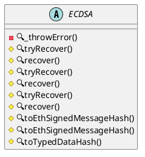

# [`@disco3/signatures`](#)

> v0.1.0


## Motivation

Reduce gas and size for ECDSA Signature Methods, reduce imported bloat, etc.


## Benchmarks


### Openzeppelin

| Contract | Size (kB) | Margin (kB) |
|----------|-----------|-------------|
| ECDSA    | 0.086     | 24.49       |
| Math     | 0.086     | 24.49       |
| Strings  | 0.086     | 24.49       |


### Disco

| Contract | Size (kB) | Margin (kB) |
|----------|-----------|-------------|
| ECDSA    | 0.045     | 24.531      |
| Strings  | 0.045     | 24.531      |


## Changes

Following changes have been made and tested

### Strings 

`Strings.sol` includes the needed `SafeMath` logic that was removed in 4.8.0 of `OpenZeppelin/Contracts`. This reduces the size of the compiled contract by 50%. 

### ECDSA 

Assembly changes

```solidity
    /**
     * @dev Returns an Ethereum Signed Message, created from `s`. This
     * produces hash corresponding to the one signed with the
     * https://eth.wiki/json-rpc/API#eth_sign[`eth_sign`]
     * JSON-RPC method as part of EIP-191.
     *
     * See {recover}.
     */
    function toEthSignedMessageHash(bytes memory s) internal pure returns (bytes32) {
        return keccak256(abi.encodePacked("\x19Ethereum Signed Message:\n", Strings.toString(s.length), s));
    }

    /**
     * @dev Returns an Ethereum Signed Typed Data, created from a
     * `domainSeparator` and a `structHash`. This produces hash corresponding
     * to the one signed with the
     * https://eips.ethereum.org/EIPS/eip-712[`eth_signTypedData`]
     * JSON-RPC method as part of EIP-712.
     *
     * See {recover}.
     */
    function toTypedDataHash(bytes32 domainSeparator, bytes32 structHash) internal pure returns (bytes32 data) {
        /// @solidity memory-safe-assembly
        assembly {
            let ptr := mload(0x40)
            mstore(ptr, "\x19\x01")
            mstore(add(ptr, 0x02), domainSeparator)
            mstore(add(ptr, 0x22), structHash)
            data := keccak256(ptr, 66)
        }
    }
```



 ## License
 
 Licensed under either of

 * Universal Permissive License 1.0
   ([LICENSE-UPL](LICENSE-UPL) or https://opensource.org/licenses/UPL)

 * MIT License
   ([LICENSE-MIT](LICENSE-MIT) or https://opensource.org/licenses/MIT)
 
 at your option.

 ### Contribution

Unless you explicitly state otherwise, any contribution intentionally submitted
for inclusion in the work by you, as defined in the Universal Permissive License v 1.0 
license, shall be dual licensed as above, without any additional terms or conditions.
